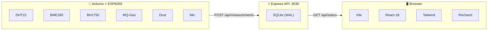

<p align="center">
  
</p>

<h1 align="center">Happiness</h1>

<p align="center">
  <strong>Office environment monitoring that puts wellbeing first.</strong><br/>
  Real-time IoT sensors → beautiful dashboard → happier humans.
</p>

<p align="center">
  
  
  
  
  
  
  
</p>

---

## What is this?

Happiness measures the invisible things that affect how you feel at work — temperature, humidity, air quality, noise, light — and distills them into a single **Happiness Score**.

An Arduino sensor station collects environment data every 5 seconds and streams it to a lightweight API. A fast, dark-themed dashboard visualizes everything in real time.

## Preview

```
┌──────────────────────────────────────────────────────────────────────────────┐
│  🟢 Happiness          │                                                    │
│                         │   Dashboard                                       │
│  ▸ Dashboard            │   Office environment at a glance                  │
│                         │                                                    │
│  HOMEBASES              │   ┌──────────────────────────────────────────┐     │
│  ▸ Prototype — Live     │   │                                          │     │
│  ▸ Prototype — History  │   │            ╭──────────────╮              │     │
│                         │   │           ╱    ╭──────╮    ╲             │     │
│                         │   │          │    │  78%  │    │             │     │
│                         │   │          │    │HAPPY  │    │             │     │
│                         │   │           ╲    ╰──────╯    ╱             │     │
│                         │   │            ╰──────────────╯              │     │
│                         │   │                                          │     │
│                         │   │     Last reading: 3/17/2026, 9:42 PM     │     │
│                         │   └──────────────────────────────────────────┘     │
│                         │                                                    │
│                         │   ┌──────────────────────────────────────────┐     │
│                         │   │  🏠 Prototype                        →  │     │
│                         │   │     Live sensor readings                 │     │
│                         │   └──────────────────────────────────────────┘     │
│                         │                                                    │
│  v2.0.0                │                                                    │
└──────────────────────────────────────────────────────────────────────────────┘
```

```
┌──────────────────────────────────────────────────────────────────────────────┐
│  🟢 Happiness          │                                                    │
│                         │   Homebase #1                    📜 View History  │
│  ▸ Dashboard            │   Live — updated 9:42:15 PM                       │
│                         │                                                    │
│  HOMEBASES              │              ╭──────────────╮                      │
│  ▸ Prototype — Live     │             ╱    ╭──────╮    ╲                     │
│  ▸ Prototype — History  │            │    │  78%  │    │                     │
│                         │            │    │HAPPY  │    │                     │
│                         │             ╲    ╰──────╯    ╱                     │
│                         │              ╰──────────────╯                      │
│                         │                                                    │
│                         │   ┌────────────┐ ┌────────────┐ ┌────────────┐    │
│                         │   │ 🌡 Temp    │ │ 💧 Humid   │ │ 🌫 Dust    │    │
│                         │   │   23.4 °C  │ │   52.1 %   │ │  142.3µg/m³│    │
│                         │   └────────────┘ └────────────┘ └────────────┘    │
│                         │   ┌────────────┐ ┌────────────┐ ┌────────────┐    │
│                         │   │ 🔥 Gas     │ │ 🔊 Volume  │ │ ☀️ Light   │    │
│                         │   │  312.0 ppm │ │   45.2 dB  │ │  487.0 lux │    │
│                         │   └────────────┘ └────────────┘ └────────────┘    │
│  v2.0.0                │   ┌────────────┐                                   │
│                         │   │ ⏲ Pressure │                                   │
│                         │   │  1013.2hPa │                                   │
│                         │   └────────────┘                                   │
└──────────────────────────────────────────────────────────────────────────────┘
```

```
┌──────────────────────────────────────────────────────────────────────────────┐
│  🟢 Happiness          │                                                    │
│                         │   ← Homebase #1 — History                         │
│  ▸ Dashboard            │   Last 50 readings                                │
│                         │                                                    │
│  HOMEBASES              │   Happiness Score                                  │
│  ▸ Prototype — Live     │   ┌──────────────────────────────────────────┐    │
│  ▸ Prototype — History  │   │  100┤                                    │    │
│                         │   │     │    ╱╲    ╱╲                        │    │
│                         │   │   75┤   ╱  ╲╱╱  ╲   ╱╲  ╱╲             │    │
│                         │   │     │  ╱         ╲ ╱  ╲╱  ╲╱╲          │    │
│                         │   │   50┤╱            ╲        ╲  ╲         │    │
│                         │   │     │                           ╲        │    │
│                         │   │   25┤                                    │    │
│                         │   │    0┤────────────────────────────────    │    │
│                         │   └──────────────────────────────────────────┘    │
│                         │                                                    │
│                         │   Temperature (°C)          Humidity (%)           │
│                         │   ┌───────────────────┐    ┌───────────────────┐  │
│                         │   │  ╱╲  ╱╲  ╱╲      │    │     ╱╲            │  │
│                         │   │ ╱  ╲╱  ╲╱  ╲╱╲   │    │ ╱╲╱  ╲╱╲  ╱╲    │  │
│                         │   │╱            ╲  ╲  │    │╱       ╲╱  ╲╱   │  │
│                         │   └───────────────────┘    └───────────────────┘  │
│  v2.0.0                │                                                    │
└──────────────────────────────────────────────────────────────────────────────┘
```


## Architecture



## Sensors & Scoring

Each sensor maps to a 0–100 sub-score based on ideal office ranges. The overall **Happiness Score** is the average. The ranges are grounded in peer-reviewed research and international standards.

| Sensor | Ideal Range | Standard / Source | Scoring |
|---|---|---|---|
| 🌡 Temperature | 20–24 °C | ASHRAE 55-2023 ¹, Seppänen et al. ² | 100 in range, degrades outside |
| 💧 Humidity | 40–60 % | ASHRAE 55-2023 ¹, ASHRAE Handbook ³ | 100 in range, degrades outside |
| 🌫 Dust (PM) | < 50 µg/m³ | WHO Air Quality Guidelines ⁴ | 100 if low, drops with concentration |
| 🔥 Gas (VOC) | < 200 ppm | OSHA PEL ⁵ | 100 if low, drops with concentration |
| 🔊 Volume | ~50 dB | WHO Noise Guidelines 2018 ⁶, UArizona study ⁷ | 100 near 50 dB, degrades above |
| ☀️ Light | 300–500 lux | EN 12464-1:2021 ⁸, IES ⁹ | 100 in range, degrades outside |
| ⏲ Pressure | 1013 ± 10 hPa | Informational — tracked for correlation ¹⁰ |

## Research & Sources

The scoring algorithm is based on the following standards and studies. Content was rephrased for compliance with licensing restrictions.

### Temperature

Peak office productivity occurs around 21–22 °C and drops measurably above 24 °C. Seppänen, Fisk & Lei (2006) analyzed multiple field studies and found performance declines roughly 2% per degree above 25 °C. ASHRAE Standard 55 recommends 20–23.5 °C in winter and 23–26 °C in summer for thermal comfort.

- ¹ [ASHRAE Standard 55-2023 — Thermal Environmental Conditions for Human Occupancy](https://blog.ansi.org/ansi/ansi-ashrae-55-2023-thermal-environmental-conditions/)
- ² [Seppänen et al. — Room temperature and productivity in office work (2006)](https://www.researchgate.net/publication/279542374_Room_temperature_and_productivity_in_office_work)

### Humidity

ASHRAE recommends maintaining indoor relative humidity between 30–60%, with the 40–60% range being optimal for minimizing bacterial and viral survival. At ~50% RH, many airborne pathogens have the lowest survival rates (ASHRAE Handbook, Ch. 22).

- ³ [ASHRAE Handbook — Humidifiers, Chapter 22](https://handbook.ashrae.org/Handbooks/S16/SI/S16_Ch22/s16_ch22_si.aspx)

### Air Quality (Dust & Gas)

The WHO recommends annual mean PM2.5 below 5 µg/m³ and 24-hour mean below 15 µg/m³. For general indoor particulate matter, keeping levels under 50 µg/m³ is considered acceptable for non-industrial spaces. OSHA sets permissible exposure limits for various gases over 8-hour shifts.

- ⁴ [WHO Global Air Quality Guidelines (2021)](https://www.hibouair.com/blog/who-guidelines-on-indoor-air-quality-and-the-role-of-air-quality-monitors/)
- ⁵ [OSHA — Occupational Noise & Air Quality Standards](https://www.osha.gov/noise)

### Sound / Noise

The WHO Environmental Noise Guidelines (2018) recommend keeping environmental noise below 53 dB (day average) to prevent adverse health effects. A University of Arizona study published in Nature Digital Medicine found that optimal physiological wellbeing in offices occurs around 50 dB — roughly equivalent to moderate rainfall or birdsong. Both louder and quieter environments increased stress markers. Chalmers University research showed cognitive performance declines at noise levels as low as 40 dB.

- ⁶ [WHO Environmental Noise Guidelines for the European Region (2018)](https://www.euro.who.int/en/health-topics/environment-and-health/noise/publications/2018/environmental-noise-guidelines-for-the-european-region-2018)
- ⁷ [University of Arizona — Ideal office noise ~50 dB (2023)](https://workinmind.org/2023/02/09/us-university-study-finds-cafe-like-noise-levels-ideal-for-office-spaces/)
- [Chalmers University — 40 dB noise impairs cognition (2023)](https://www.news-medical.net/news/20230519/Noise-levels-as-low-as-40-dB-can-lead-to-a-decline-in-work-performance-study-shows.aspx)
- [Forbes — What Is The Ideal Noise Level For The Office?](https://www.forbes.com/sites/adigaskell/2023/03/21/what-is-the-ideal-noise-level-for-the-office/)

### Light

The European standard EN 12464-1:2021 specifies 300 lux for screen-based office tasks and 500 lux for paper-based tasks. The Illuminating Engineering Society (IES) recommends 300–500 lux for general office work. Cornell University research found that workers in daylit offices reported 51% fewer eyestrain complaints and 63% fewer headaches. A Frontiers in Built Environment study found 500 lux at 4000–6500K optimal for sustained reading tasks.

- ⁸ [EN 12464-1:2021 — Lighting of Indoor Workplaces](https://www.any-lamp.com/blog/european-standard-nen-124641/)
- ⁹ [IES — Lighting Ergonomics in the Workplace](https://hsewatch.com/lighting-ergonomics/)
- [Frontiers — Indoor lighting and reading efficiency (2023)](https://www.frontiersin.org/articles/10.3389/fbuil.2023.1303028)
- [Cornell — Daylight and worker wellbeing](https://getawair.com/blog/what-we-measure-light)

### Atmospheric Pressure

Barometric pressure is tracked for correlation rather than scored. Rapid pressure changes (not absolute values) are associated with headaches, joint pain, fatigue, and mood shifts. The effects are modest in healthy individuals but can be significant for those with migraines or arthritis.

- ¹⁰ [Barometric pressure and health effects](https://getuhoo.com/blog/home/air-pressure-effects/)
- [Science Insights — Barometric pressure and the human body](https://scienceinsights.org/how-does-barometric-pressure-affect-humans/)

## Quick Start

```bash
# 1. Install
cd happiness
npm install

# 2. Seed demo data
npm run api:seed

# 3. Start API (terminal 1)
npm run api
# 🟢 Happiness API running on http://localhost:3030

# 4. Start frontend (terminal 2)
npm run dev
# ➜ Local: http://localhost:5173
```

Open [localhost:5173](http://localhost:5173) and you're in.

## Project Structure

```
happiness/
├── api/                  # Express + SQLite backend
│   ├── db.ts             # Database schema & connection
│   ├── happiness.ts      # Scoring algorithm
│   ├── seed.ts           # Demo data generator
│   └── server.ts         # REST endpoints
├── iot/                  # Arduino firmware
│   ├── firmware.ino      # Sensor reading + WiFi POST
│   └── README.md         # Wiring & setup guide
├── src/                  # Vite + React frontend
│   ├── components/       # HappinessRing, SensorCard, SensorChart, Sidebar
│   ├── hooks/            # usePolling (auto-refresh)
│   ├── pages/            # Dashboard, HomebaseLive, HomebaseHistory
│   ├── api.ts            # API client
│   └── types.ts          # TypeScript interfaces
├── package.json
├── vite.config.ts
├── tailwind.config.js
└── Dockerfile
```

## API Endpoints

| Method | Endpoint | Description |
|---|---|---|
| `GET` | `/api/homebases` | List all homebases |
| `GET` | `/api/homebases/:id` | Get a homebase |
| `POST` | `/api/homebases` | Create a homebase |
| `POST` | `/api/measurements` | Submit a measurement (JSON) |
| `GET` | `/api/measurements/:homebaseId` | Get measurements |
| `GET` | `/api/status/:homebaseId` | Measurements + happiness score |
| `GET` | `/api/status/:homebaseId/latest` | Latest reading + score |
| `GET` | `/api/measurements/:id/:h/:t/:d/:g/:p/:v/:l` | IoT compat (GET-based insert) |

## IoT Setup

The Arduino firmware in `iot/firmware.ino` reads from 6 sensors and POSTs JSON to the API every 5 seconds.

Edit the configuration block in the firmware:
```cpp
const char* WIFI_SSID = "YourWiFi";
const char* WIFI_PASS = "YourPassword";
const char* API_HOST  = "192.168.1.100";
const int   API_PORT  = 3030;
const int   HOMEBASE_ID = 1;
```

See [`iot/README.md`](iot/README.md) for full wiring and library details.

## Docker

```bash
docker build -t happiness .
docker run -p 3030:3030 happiness
```

The production build serves the Vite frontend as static files from the Express API.

## Tech Stack

| Layer | Tech |
|---|---|
| Frontend | Vite 6, React 18, TypeScript, Tailwind CSS, Recharts, Lucide Icons |
| Backend | Express 4, better-sqlite3 (WAL mode), TypeScript |
| IoT | Arduino, ESP8266, DHT22, BME280, BH1750, MQ gas sensor |
| Infra | Docker, nginx-ready |

## History

This project started as three separate repos:

- `happiness-api` — LoopBack 4 REST API (Node 8 era)
- `happiness-web` — React 16 + Create React App + Ant Design 3
- `happiness-iot` — Arduino sketch

They've been unified into a single modern codebase with a real happiness scoring algorithm (the old one was `Math.random()` 😅).

## License

[GPL-3.0](LICENSE) — Marko Zanoski & Brendan Mullins
