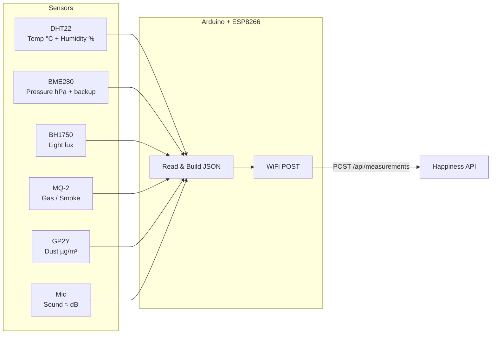
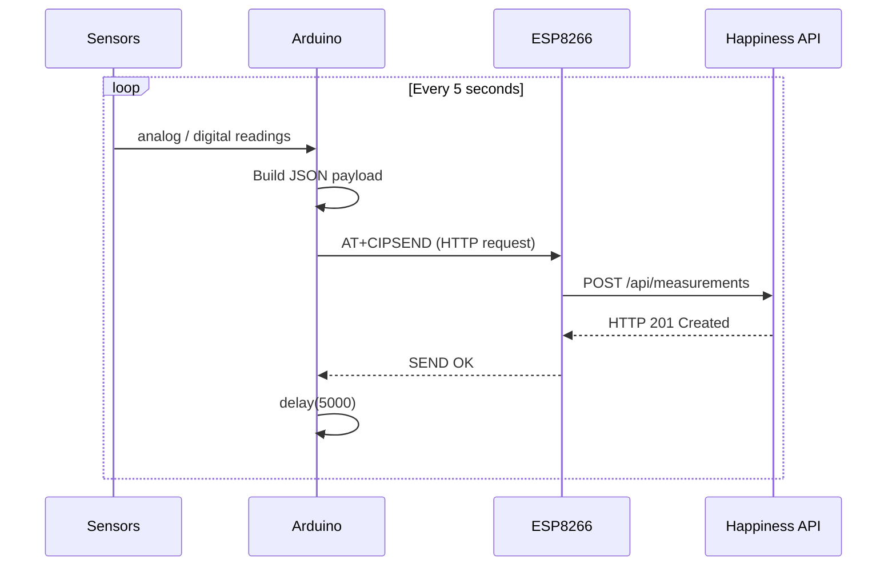

<p align="center">
  
</p>

<h1 align="center">Happiness — IoT Sensor Station</h1>

<p align="center">
  Arduino-based office environment monitor.<br/>
  6 sensors → JSON → WiFi → Happiness API
</p>

---

## What It Does

The sensor station reads your office environment every 5 seconds and sends the data to the Happiness API over WiFi. The dashboard then visualizes it in real time.



## Parts List

| Part            | Model                                         | Purpose                    | ~Cost |
| --------------- | --------------------------------------------- | -------------------------- | ----- |
| Microcontroller | Arduino Uno / Nano                            | Main brain                 | $5–25 |
| WiFi module     | ESP8266 (ESP-01)                              | HTTP POST over WiFi        | $2–5  |
| Temp & humidity | DHT22 (AM2302)                                | Temperature + humidity     | $3–8  |
| Env sensor      | BME280 (SPI)                                  | Pressure + backup temp/hum | $3–10 |
| Light sensor    | BH1750 (I2C)                                  | Ambient light in lux       | $2–5  |
| Gas sensor      | MQ-2 / MQ-135                                 | Smoke / air quality        | $2–5  |
| Dust sensor     | GP2Y1010AU0F                                  | Particulate matter         | $5–12 |
| Microphone      | Analog sound module                           | Noise level                | $1–3  |
| Misc            | Breadboard, jumpers, 10kΩ resistor, USB cable | —                          | $5    |

Total: roughly $25–75 depending on where you source parts.

## Wiring Diagram

```
                            Arduino Uno / Nano
                         ┌──────────────────────┐
                         │                      │
    DHT22                │                      │          ESP8266 (ESP-01)
    ┌─────┐              │                      │          ┌──────────┐
    │ VCC ├──── 5V ──────┤ 5V              D4   ├──────────┤ TX       │
    │ DAT ├──── D2 ──────┤ D2              D5   ├──────────┤ RX       │
    │ GND ├──── GND ─────┤ GND            3.3V. ├──────────┤ VCC+EN   │
    └─────┘              │                 GND  ├──────────┤ GND      │
     (10kΩ pullup        │                      │          └──────────┘
      DAT → VCC)         │                      │
                         │                      │
    BME280 (SPI)         │                      │          BH1750 (I2C)
    ┌─────────┐          │                      │          ┌──────────┐
    │ VCC  ├── 5V ───────┤ 5V              A4   ├──────────┤ SDA      │
    │ GND  ├── GND ──────┤ GND             A5   ├──────────┤ SCL      │
    │ SCK  ├── D13 ──────┤ D13            3.3V  ├──────────┤ VCC      │
    │ MISO ├── D12 ──────┤ D12             GND  ├──────────┤ GND      │
    │ MOSI ├── D11 ──────┤ D11                  │          │ ADDR→GND │
    │ CS   ├── D10 ──────┤ D10                  │          └──────────┘
    └─────────┘          │                      │
                         │                      │
    MQ-2 Gas Sensor      │                      │          Dust Sensor
    ┌─────────┐          │                      │          ┌──────────┐
    │ VCC  ├── 5V ───────┤ 5V                   │          │ VCC ── 5V│
    │ AOUT ├── A0 ───────┤ A0              D8   ├──────────┤ DATA     │
    │ GND  ├── GND ──────┤ GND             GND  ├──────────┤ GND      │
    └─────────┘          │                      │          └──────────┘
                         │                      │
    Mic Module           │                      │
    ┌─────────┐          │                      │
    │ VCC  ├── 5V ───────┤ 5V                   │
    │ AOUT ├── A2 ───────┤ A2                   │
    │ GND  ├── GND ──────┤ GND                  │
    └─────────┘          └──────────────────────┘
```

### Pin Summary

| Arduino Pin | Connected To     | Protocol          |
| ----------- | ---------------- | ----------------- |
| D2          | DHT22 DATA       | Digital (1-Wire)  |
| D4          | ESP8266 TX       | SoftwareSerial RX |
| D5          | ESP8266 RX       | SoftwareSerial TX |
| D8          | Dust sensor DATA | Digital pulse     |
| D10         | BME280 CS        | SPI               |
| D11         | BME280 MOSI      | SPI               |
| D12         | BME280 MISO      | SPI               |
| D13         | BME280 SCK       | SPI               |
| A0          | MQ-2 AOUT        | Analog            |
| A2          | Mic AOUT         | Analog            |
| A4          | BH1750 SDA       | I2C               |
| A5          | BH1750 SCL       | I2C               |

### Important Notes

- The ESP8266 runs on 3.3V — do NOT connect it to 5V or it will fry. Use the Arduino's 3.3V pin or a voltage regulator.
- The ESP8266 RX pin needs a voltage divider (5V → 3.3V) since Arduino outputs 5V logic. A simple 1kΩ + 2kΩ divider works:
  ```
  Arduino D5 ──[1kΩ]──┬──[2kΩ]── GND
                       │
                  ESP8266 RX
  ```
- DHT22 needs a 10kΩ pull-up resistor between DATA and VCC.
- Let the MQ-2 gas sensor warm up for ~2 minutes after power-on for accurate readings.
- BH1750 ADDR pin to GND sets I2C address to 0x23 (default).

## Arduino IDE Setup

### 1. Install Libraries

Open Arduino IDE → Sketch → Include Library → Manage Libraries, then install:

| Library                 | Author           | Version |
| ----------------------- | ---------------- | ------- |
| ArduinoJson             | Benoit Blanchon  | 6.x     |
| DHT sensor library      | Adafruit         | latest  |
| Adafruit BME280 Library | Adafruit         | latest  |
| Adafruit Unified Sensor | Adafruit         | latest  |
| BH1750                  | Christopher Laws | latest  |

### 2. Configure

Open `firmware.ino` and edit the configuration block:

```cpp
const char* WIFI_SSID = "MyWiFi";           // Your WiFi name
const char* WIFI_PASS = "MyPassword";        // Your WiFi password
const char* API_HOST  = "192.168.1.42";      // Computer running the API
const int   API_PORT  = 3030;                // API port
const int   HOMEBASE_ID = 1;                 // Your homebase ID
const unsigned long READ_INTERVAL_MS = 5000; // Read every 5 seconds
```

### 3. Upload

1. Select your board: Tools → Board → Arduino Uno (or Nano)
2. Select port: Tools → Port → /dev/cu.usbmodem... (macOS) or COM3 (Windows)
3. Click Upload (→)

### 4. Monitor

Open Serial Monitor (Tools → Serial Monitor) at 9600 baud. You should see:

```
╔═══════════════════════════════════╗
║   Happiness Sensor Station v2.0   ║
╚═══════════════════════════════════╝
Team: Heisenberg

[OK] DHT22 initialized
[OK] BH1750 light sensor initialized
[OK] BME280 initialized
[OK] Analog sensors ready

Connecting to WiFi...
  AT> AT ✓
  AT> AT+CWMODE=1 ✓
  AT> AT+CWJAP="MyWiFi","MyPassword" ✓
[OK] WiFi connected

Starting sensor loop...
─────────────────────────────────────

🌡 23.4°C  💧 51.2%  ☀ 487lux  🔊 42.1dB  🌫 128µg  🔥 312ppm  ⏲ 1013.2hPa
  → Sent ✓

🌡 23.5°C  💧 51.0%  ☀ 490lux  🔊 38.7dB  🌫 125µg  🔥 308ppm  ⏲ 1013.1hPa
  → Sent ✓
```

## Data Flow



## Troubleshooting

| Problem                  | Fix                                                           |
| ------------------------ | ------------------------------------------------------------- |
| `[!!] DHT22` in serial   | Check D2 wiring + 10kΩ pull-up resistor                       |
| `[!!] BME280 not found`  | Check SPI wiring (D10-D13), verify 5V power                   |
| `[!!] BH1750 not found`  | Check I2C wiring (A4/A5), ADDR pin to GND                     |
| WiFi `AT` commands fail  | Check ESP8266 power (3.3V!), baud rate, TX/RX swap            |
| `Send failed ✗`          | Verify API is running, check HOST IP, firewall                |
| Gas readings always high | MQ-2 needs 2 min warm-up, check if sensor is in clean air     |
| Light always 0           | BH1750 may need `Wire.begin()` — already called by `.begin()` |
| Dust always 0            | Dust sensor needs airflow, check D8 wiring                    |
| Sound readings erratic   | Mic module gain pot may need adjustment                       |

## Testing Without Hardware

If you don't have the Arduino hooked up, you can simulate sensor data using curl:

```bash
# Single measurement
curl -X POST http://localhost:3030/api/measurements \
  -H "Content-Type: application/json" \
  -d '{
    "homebase_id": 1,
    "temperature": 23.4,
    "humidity": 51.2,
    "dust": 128,
    "gas": 312,
    "volume": 42.1,
    "light": 487,
    "pressure": 1013.2
  }'

# Or use the seed script to generate 100 demo readings:
cd .. && npm run api:seed
```

## Photo Reference

A typical assembled station looks like this:

```
    ┌─────────────────────────────────────────┐
    │  ┌───────┐                              │
    │  │Arduino│  ┌─────┐  ┌──────┐  ┌─────┐  │
    │  │  Uno  │  │DHT22│  │BH1750│  │MQ-2 │  │
    │  │       │  └──┬──┘  └──┬───┘  └──┬──┘  │
    │  │       │     │        │         │     │
    │  │  ┌────┤─────┴────────┴─────────┘     │
    │  │  │USB │                              │
    │  └──┴────┘  ┌──────┐  ┌────┐  ┌──────┐  │
    │             │BME280│  │Mic │  │ Dust │  │
    │             └──────┘  └────┘  └──────┘  │
    │                                         │
    │  ┌────────┐                             │
    │  │ESP8266 │  ← tucked underneath        │
    │  └────────┘                             │
    │          BREADBOARD                     │
    └─────────────────────────────────────────┘
```

Tip: mount the dust and gas sensors near the edge for better airflow. Keep the light sensor unobstructed and facing up.
